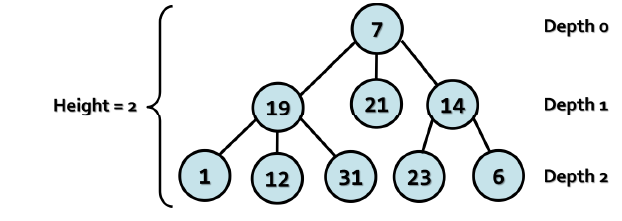

# Trees and Graphs

- binary trees, binary search trees and self balanacing binary search tree
- graph, types of graphs and how to represent a graph in the memory

# Tree Data Structures

Very often we have to describe a group of real life objects, which have such relation to one another that we cannot use linear data structures for their description. A tree-like data structure or branched data structure consists of a set of elements(nodes) which could be linked to other elements, sometimes hierarchially, sometimes not. Trees represent hierarchies, while graphs represent more general relationsh such as the map of a city

## Trees

Trees are very often used in programming, because they naturally represent all kinds of object hierarchies from our surroundings.

### Trees Terminology

We will simplify the figure describing our hierarchy. We assume it consists of circles and lines connecting them. For convenience, we name the circles with unique numbers, so that we can easily specify about which one we are talking about.

We will call every circle a node and each line an edge.direct descendants (child nodes) of node "7", and node "7" their parent. The same way "1", "12" and "31" are children of "19" and "19" is their parent. Intuitively we can say that "21" is sibling of "19", because they are both children of "7" (the reverse is also true – "19" is sibling of "21").For "1", "12", "31", "23" and "6" node "7" precedes them in the hierarchy, so he is their indirect parent – ancestor, ant they are called his descendants.

The **Root** is the node without a parent. In our example this is node 7.

**Leaf** is a node without child nodes. In our example - "1","12","31","21","23" and "6"

**Internal nodes** are the nodes , which are not leaf or root ( all nodes, which have parent and at least one child.) Such nodes are "19" and "14"

A **Path** is called a sequence of nodes connected with edges in which there is no repetion of nodes. Example of path is the sequence "1", "19", "7" and "21". The sequence "1", "19" and "23" is not a path, because "19" and "23" are not connected.

**Path lenght** is the number of edges, connecting the sequence of nodes in the path. It is equal to the number of nodes in the path minus 1. The length of our example for path ("1", "19", "7" and "21") is three.

**Depth** of a node we will call the length of the path from the root to a certain node. In our example "7" as root depth zero, "19" has depth one and "23" has depth two.

Tree is a recursive data structure, which consists of nodes, connected with edges. The following statements are true for trees

- Each node can have 0 or more direct descendats(children)
- Each node has at most one parent. There is only one special node without a parent - the root (if the tree is not empty)
- All nodes are reachable from the root - there is a path from the root top each node in the tree.

**The Height of a tree** - is the maximu depth of all its nodes. In our example the tree height is 2.
**The Degree** of the node is the _number of direct children_ of the given node. The degree of "19" and "7" is three, but the degree of "14" is two. The leaves have degree zero.

**Branching factor** is the maximu of the degrees of all nodes in the tree. In our example, the maximu degree of the nodes is 3, so the branching factor is 3.

### Tree Implementation - Example
Our tree will contain numbers inside its nodes, and each node will have a list of zero or more children, which are trees too (following our recursive definition)

Each node is recursively defined using itself. Each node of the tree (**`TreeNode<T>`**) contains a list of children, which are nodes. The tree itself is another class **`Tree<T>`** which can be empty or can have a root node.